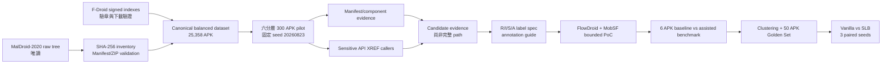

# 8/11–8/25 APK 授權風險專題進度報告

- **報告日期**：2026-08-25 下午
- **涵蓋期間**：2026-08-11～2026-08-25
- **專案主題**：MalDroid-2020／F-Droid canonical dataset、Android component-path authorization risk 與 Selective Label Bootstrapping（SLB）
- **目前階段（2026-09-02 更新）**：300 APK pilot 已完成；先做 FlowDroid／MobSF bounded PoC 與 6 APK 工時 benchmark，通過後建立單一 reviewer 的 50 APK Golden Set
- **HackMD 連結**：上傳後補上
- **雲端資料夾連結**：上傳後補上

---

## 2026-09-02 會議決策更新（取代舊版後續規劃）

本報告原先記錄的「29-unit calibration、12-unit secondary review、240～360 Gold rows、development + sealed tests」是 8/25 當時的規劃，已由後續會議決策取代。實作一律以下列範圍為準：

1. 找不到第二位 reviewer；由指定 reviewer 依 R/I/S/A 人工覆核並建立 Gold，保留完整 evidence 與 append-only provenance。
2. Golden Set 固定為 50 個 APK，從 300-APK pilot 的 297 個 parse-success APK 以 clustering 後跨群集選樣；50 是 APK membership 數，一個 APK 可有多個 candidate/path review units。
3. Golden Set 不參與 Vanilla／SLB training 或 SLB label revision，只作共同獨立評估；human unknown 不轉成 negative。
4. 原 247 APK 是 weak-training candidate pool 上限；與 Golden 相同 SHA、package 或 lineage 的 sibling 必須排除。
5. 先做 FlowDroid CLI PoC，再做 MobSF Docker sidecar PoC；以 low／medium／high complexity 各一組 matched pair，共 6 APK，比較 baseline manual review 與 tool-assisted review。通過後才套用 50 APK。
6. 正式模型只比較共用同一 `anti_leakage_feature_profile` 的 Vanilla DNN 與 Genuine SLB DNN；R0/RF 只作 rule-reconstruction diagnostic。
7. 正式比較使用 seeds `20260823`、`20260824`、`20260825`，Vanilla／SLB 各三次，共六次 training runs。
8. 正式 Golden evaluation 前建立 configuration lock，不使用 Golden labels 選 feature、epoch、threshold、model 或 hyperparameters。
9. 主要指標為 Macro F1；另報 confusion matrix、兩類 precision/recall/F1、balanced accuracy、unknown count/rate 與 coverage。
10. `revised_authz_label` 仍是模型推定，不是 ground truth；本版驗證 SLB 的下游分類效益，不宣稱 training pool 上的 individual revisions 已全部人工驗證。

---

## 一、這次最重要的進度

從 8/11 開始，工作已從「整理來源不一且可能重複的 APK」推進到「具有固定 membership、可重現抽樣、逐筆 SHA-256 驗證、可產生 Manifest/component 與 sensitive API caller 證據的 300 APK pilot」。

目前最重要的五點如下：

1. 已建立 **25,358 筆、Benign／Non-benign 各 12,679 筆**的 canonical balanced dataset，且 25,358 筆 SHA-256 皆唯一。
2. 已確認舊版 authorization-risk pipeline 的 `F1=1.0` 主要是在重建 `exported && !protected` 規則，不能當作真實越權偵測成效。
3. 已把研究單位改成可稽核的 **component/candidate/path**，並將授權風險拆成 R/I/S/A 四個必要條件。
4. 已完成固定 seed、六分層各 50 筆的 **300 APK pilot**：300 筆來源皆存在且 SHA-256 全數相符，297 筆成功解析，成功率 99%。
5. 下一步不是直接訓練 SLB，也不是一次分析全部 25,358 APK；而是先完成 FlowDroid／MobSF bounded PoC 與 6 APK 工時 benchmark，再建立 50 APK Golden Set。

### 口頭報告 30 秒版本

> 這兩週先把 MalDroid-2020 與 F-Droid 整理成 25,358 筆可追溯、SHA-256 唯一且良惡性平衡的 canonical dataset。接著稽核舊模型後發現 F1=1.0 主要是 label leakage，因此沒有直接套 SLB，而是先重定義 component-path authorization label。8/23 已完成六分層 300 APK pilot，300 筆 SHA-256 全部吻合、297 筆解析成功；但目前只有 Manifest candidates 與 sensitive API XREF caller evidence，還不能把全部結果宣稱為真實 entry-to-sink path 或漏洞。依後續會議決策，下一步先以 FlowDroid 與 MobSF 降低人工 evidence 搜尋量，再建立指定 reviewer 覆核的 50 APK Golden Set。

---

## 二、目前資料流與研究位置



目前做到圖中的 **R/I/S/A label spec 與 annotation guide**。下一個工程階段是工具 bounded PoC；50 APK Golden artifacts 與 `slb_trainer.py` 均尚未建立。

---

## 三、8/11～8/25 工作時間線

### 8/11～8/14：MalDroid-2020 清查、canonicalization 與 F-Droid 平衡

#### 已完成

- 將 `E:\MalDroid-2020\APKs` 視為唯讀來源，不修改原始檔名、路徑或內容。
- 不再只依 `.apk` 副檔名計數；改為掃描五個 class 目錄中的普通檔案，排除 `.sh` helper，並以檔案內容 SHA-256 作為 sample identity。
- 完成 17,242 個候選檔案的 inventory；記錄 ZIP、CRC、Manifest、DEX、重複副本與跨標籤衝突。
- 使用 Androguard `AXMLPrinter` 驗證 binary `AndroidManifest.xml`，而非只看 ZIP 中是否存在 Manifest entry。
- 建立 16,716 筆 canonical MalDroid records：
  - Benign：4,037
  - Non-benign：12,679
- 驗證官方 F-Droid `repo/index-v2.json`／`archive/index-v2.json` 的 detached signatures；再依 index 中的 size、SHA-256、ZIP CRC、Manifest 與 package name 驗證下載結果。
- 選入 8,642 筆經驗證的 F-Droid benign APK，補足 1:1 平衡。
- 完成 final canonical dataset：
  - 總筆數：25,358
  - Benign：12,679
  - Non-benign：12,679
  - Unique SHA-256：25,358
  - MalDroid/F-Droid source overlap：0

#### 可稽核識別

- Canonical CSV：`canonical_balanced_dataset.csv`
- Canonical CSV SHA-256：`74ae94861f754cceb398bd71f963164081757a354789fd83eede10e1780cccf4`
- Final membership fingerprint：`1769ba845dc7c02c837cbe0c7e282f351a4daa89789db81c888e27bef5e406a6`
- 唯一 membership authority：
  `C:\Users\s1002\Documents\ChatGPT\資料集處理\maldroid_pipeline\outputs\final\canonical_balanced_dataset.csv`

### 8/15～8/19：SLB 論文理解與既有模型 label leakage 稽核

#### 已完成

- 細讀〈Deep Learning from Imperfectly Labeled Malware Data〉第 3 節，釐清：
  - Data Split；
  - 跨 epoch 預測一致性；
  - `D_c`／`D_n`；
  - majority pseudo-label；
  - Class-Balanced Loss；
  - EMA；
  - Continuous Revision。
- 釐清 `D_n` 只是疑似 noisy set，不等於已確認錯標；EMA argmax 也是條件式 revised/pseudo label，不是 ground truth。
- 稽核現有 authorization-risk 訓練資料與 features：
  - label 1 由 `exported=True AND protected=False` 直接產生；
  - features 同時含 `exported`、`protected`、`permission` 與 `permission_<NONE>` proxy；
  - 當時檢查的 256 component rows／68 sample IDs 與規則零不一致；
  - Random Forest train/validation/test `F1=1.0` 只能證明模型重建規則，不能證明模型偵測到真實 authorization risk。
- 確立三層 label 必須分開保存：
  - `observed_authz_label`：weak/noisy observation；
  - `gold_authz_label`：指定 reviewer 依 R/I/S/A 人工覆核；
  - `revised_authz_label`：SLB 或其他 revision 方法的輸出，不能覆寫前兩者。

### 8/22：實作時程、Git 整理與 prototype 邊界

#### 已完成

- 完成 `docs/SLB越權偵測實作時程.md`，將工作拆成 evidence、label、gold、baseline、SLB 與 held-out evaluation。
- 完成 `docs/NOTES_realworld_exported_semantics.md`，記錄 launcher-only、第三方 SDK、platform-required component 等可能造成 semantic false positive 的情況。
- 將尚未完成 production integration 的 KAN-39 sensitive API detector 保留在 `prototypes/kan39/`，避免把 prototype 誤當正式 pipeline。
- 已有 Git commits：
  - `28af031 chore(ai-model): organize local artifacts and archive KAN-39 prototype`
  - `24b82ef docs(authz): record exported semantics and SLB implementation schedule`
- 截至 8/25，`main` 與 `origin/main` 均指向 `24b82ef`。

### 8/23：唯讀 canonical consumer 與 300 APK pilot

#### 實作內容

- 新增固定 seed、六分層抽樣的 canonical consumer。
- 每筆依 canonical CSV 的 `source_path` 取檔，驗證 source existence、size 與 SHA-256；不以掃描實體目錄取代 canonical membership。
- 加入 per-file failure continuation；單一 APK 解析失敗不會中止整批。
- 擷取 Manifest/component evidence、manifest-only resolution candidates 與 sensitive API XREF callers。
- 修正 Windows CP950 環境下 Androguard 內建 UTF-8 resource 讀取問題，避免因 locale 造成解析器載入失敗。

#### Pilot 抽樣

- Seed：`20260823`
- 每層 50 筆，共 300 筆：
  - F-Droid Benign
  - MalDroid Benign
  - MalDroid Adware
  - MalDroid Banking
  - MalDroid Riskware
  - MalDroid SMS
- Selected manifest SHA-256：`e4f312c06f35b1fd0b34041a38af9a9063383b4ab712d6a460cc20e54c1c4bf5`

### 8/24：Authorization label specification 與 annotation guide

#### 已完成草案

- `docs/authz_label_spec.md`
- `docs/authz_annotation_guide.md`
- 更新 `docs/SLB越權偵測實作時程.md`

#### 核心定義

- 分開三種記錄：analysis attempt、candidate row、concrete component-path row。
- Candidate 只有 `candidate_id`；只有真正建立 entry-to-sink chain 才能填 `path_id`。
- Gold label 依 R/I/S/A 判定：

| Predicate | 中文說明 | `confirmed` 的意義 |
|---|---|---|
| R | External reachability | 第三方 app 在威脅模型下可到達 component/entry |
| I | Attacker-controlled input influence | 外部輸入可影響敏感效果的參數、狀態或控制流程 |
| S | Sensitive effect reachability | entry 可沿具體、受支援的 chain 到達 sensitive effect |
| A | Authorization failure | 敏感效果前缺少有效且不可繞過的 authorization guard |

- `positive`：R/I/S/A 全部 confirmed。
- `negative`：至少一項被充分且可稽核的 evidence refute。
- `unknown`：沒有條件被可靠 refute，但至少一項仍不確定。
- Weak LF／model 對無法決定的案例使用 `abstain`，不得與 human `unknown` 混為一談。
- Malware family、`binary_label`、`risk_hint`、`exported && !protected` 與 allowlist match 只能作 metadata／weak evidence，不能直接產生 gold。

### 8/25：驗證、整理與報告

- 針對 `tests/` 執行完整測試：**180 passed**。
- 有 4,812 個既有 NumPy/joblib deprecation warnings，沒有 test failure。
- 從 repository root 不限定路徑執行 pytest 時，會因既有 `tmp/pytest-model-audit` 的 Windows permission error 在 collection 階段停止；改為明確測試 `tests/` 後全部通過。此問題屬測試收集範圍／暫存目錄權限，不是 pilot 測試失敗。
- `git diff --check` 通過；只有 LF/CRLF line-ending warnings。
- Pilot implementation、label spec 與 annotation guide 目前仍在 working tree，**尚未 commit**；`output/canonical_pilot/` 也不是 Git handoff 的替代品。

---

## 四、300 APK pilot 結果

### 4.1 驗證與解析

| 指標 | 結果 |
|---|---:|
| 選樣數 | 300 |
| `source_path` 存在 | 300 / 300 |
| SHA-256 相符 | 300 / 300（100%） |
| Size 相符 | 300 / 300 |
| 解析成功 | 297 / 300（99%） |
| 解析失敗 | 3 / 300 |
| 失敗類型 | `parse_invalid_bytecode` |
| 平均成功解析時間 | 3.3768 秒／APK |
| P50 | 0.8805 秒 |
| P95 | 12.2761 秒 |
| 最慢 | 111.1036 秒 |
| 整批 wall-clock duration | 1007.1233 秒（約 16.8 分鐘） |

三筆失敗都來自 MalDroid Banking stratum；已逐筆記錄錯誤並繼續整批，沒有把失敗樣本強迫標為 negative。

### 4.2 Evidence 數量

| 指標 | 結果 |
|---|---:|
| 全部 Manifest components | 5,354 |
| Component evidence rows | 2,338 |
| Exported component rows | 2,262 |
| Exported 且現行規則視為 unprotected | 2,045 |
| Manifest-only resolution candidates | 2,338 |
| Sensitive API call sites | 43,419 |
| Distinct sensitive API callers | 28,153 |
| 有 caller evidence 的 APK | 293 |
| Caller class 可直接對到 Manifest component class | 953 |
| 可直接對到 lifecycle entry method | 235 |

### 4.3 不能過度解讀的地方

這些數字是 **coverage／candidate evidence**，不是漏洞數量。

- 2,338 筆 `manifest_path_evidence` 是 manifest-only 1:1 resolution candidates，caller 仍可能是 `<UNKNOWN>`；檔名含 `path` 不代表已建立 concrete entry-to-sink chain。
- 43,419 個 sensitive API call sites 是 allowlist XREF matches；像 `Cursor.getString`、`FileInputStream` 等 API 仍需要 data-flow/context 才能判定是否為真正 sensitive effect。
- 目前只確認同一 class 中 lifecycle entry method 直接呼叫 sensitive API 的案例；尚無一般性的跨方法 call graph，因此不能證明大多數 component entry 能到達 caller/sink。
- Runtime authorization guard 與 attacker-controlled input influence 尚未完整分析。
- Reflection、native code、runtime-loaded code 與 unresolved dynamic dispatch 均可能造成 static coverage gap。
- 「沒有偵測到」不能解讀為「不存在」；證據不足時保留 `unknown/abstain`。

---

## 五、遇到的障礙與處理方式

| 障礙 | 影響 | 處理方式 | 後續原則 |
|---|---|---|---|
| 只數 `.apk` 會漏掉 Adware／SMS 中無副檔名的 APK bytes | 初始數量與 class 分布錯誤 | 掃描 ordinary files、排除 helper scripts、以 SHA-256 識別 | 不以檔名或副檔名當 sample identity |
| 長時間 ZIP/CRC 掃描看似停住 | 容易誤判失敗並重跑 | SQLite checkpoint、per-file commit、ZIP resource limit、可續跑 | 長任務必須可觀測、可中斷、可恢復 |
| Manifest entry 存在但不代表有效 | 可能把損壞或非 Android binary XML 納入 | 使用 AXML parser 驗證並取 package identity | Presence check 與 parse success 分開 |
| F-Droid 舊公鑰 URL 404 | 無法驗證 index trust | 從官方 signed JAR 取得 key，核對 fingerprint，再驗 detached signatures | 只信任已驗章 index，不信任臨時 URL list |
| 多個 orphan downloader 同時寫 `.part` | HTTP 416、size inflation、file lock | 清理 stale process、single-instance lock、reserve replacement | 實體下載數不等於 canonical membership |
| Windows CP950 讀 Androguard UTF-8 resources 失敗 | Analyzer 在載入階段 crash | 對 Androguard resource open 明確指定 UTF-8 | 不把 locale error 誤判為 APK 損壞 |
| 舊 label 與 features 共享同一規則 | F1=1.0 但無法證明真實風險 | 把規則降為 LF，切分 observed/gold/revised labels，移除 rule inputs/proxies | Anti-leakage evaluation 必須使用 held-out gold |
| 三筆 APK 含 invalid bytecode | 個別 DEX 解析失敗 | 記錄 `parse_invalid_bytecode` 並繼續整批 | Failure/unknown 不能強迫成 negative |
| Root-level pytest 掃到無權限 tmp 目錄 | Collection 階段停止 | 明確執行 `pytest tests`，180 tests 全數通過 | 將 temp output 與 test roots 分離 |

---

## 六、目前完成、尚未完成與不能宣稱的內容

### 已完成

- Canonical MalDroid/F-Droid membership 與 SHA-256 稽核鏈。
- 25,358 筆平衡資料集與 human-readable XLSX 報告。
- SLB 方法理解、label leakage 稽核與實作時程。
- 300 APK 固定 seed、六分層、唯讀 pilot。
- Manifest/component 與 sensitive API caller evidence outputs。
- Authorization label specification 與 annotation guide 草案。
- `tests/` 全套 180 tests 通過。

### 尚未完成

- FlowDroid bounded CLI PoC 與 source/sink v1 definition。
- MobSF version-pinned Docker sidecar PoC。
- 6 APK baseline-vs-assisted reviewer-workload benchmark。
- Clustering 選樣與 50 APK Golden membership／annotation artifacts。
- 指定 reviewer 對 50 APK 進行 R/I/S/A 人工覆核。
- General interprocedural entry-to-sink call graph、input influence 與 runtime guard analysis。
- Weak labeling functions、anti-leakage feature profiles、baseline benchmark 與 genuine SLB trainer。
- 8/23～8/24 implementation/doc changes 的 Git commit／code review。

### 現階段不能宣稱

- 不能說 2,338 筆 manifest candidates 是 2,338 條已確認攻擊路徑。
- 不能說 43,419 個 allowlist call sites 是 43,419 個漏洞。
- 不能說 `exported && !protected` 就等於越權。
- 不能用 MalDroid benign/non-benign 或 family label 當 authorization ground truth。
- 不能把 `F1=1.0` 當作真實 authorization-risk detection 成效。
- 不能把 SLB revised label 稱為 ground truth。

---

## 七、8/25 下午建議展示順序

若口頭時間約 5～8 分鐘，建議依下列順序：

1. **先講問題**：來源 APK 重複、檔名不可靠、label 與 feature leakage，無法直接訓練可信模型。
2. **再講已建立的基礎**：25,358 筆 canonical balanced dataset，SHA-256 唯一，來源可追溯。
3. **展示 pilot 數字**：300 筆 SHA 全相符、297 筆成功、2,338 component candidates、28,153 callers。
4. **主動講限制**：candidate/XREF 不是 path 或漏洞；input 與 runtime guard 尚未證實。
5. **講研究方法修正**：R/I/S/A、observed/gold/revised 分離、unknown/abstain。
6. **最後講下一步與需要協作的地方**：FlowDroid／MobSF PoC、6 APK 工時 benchmark、clustering 後建立 50 APK Golden Set。

建議畫面只開：

- 本進度報告；
- `maldroid2020_balanced_report.xlsx` 的 Summary sheet；
- `output/canonical_pilot/pilot_300_six_strata_seed_20260823_v3/REPORT.md`；
- `docs/authz_label_spec.md` 的 R/I/S/A decision table。

---

## 八、要附給學姊的內容

學姊版以「可快速掌握進度、能驗證主要數字、能做研究方向決策」為主，不需要先放完整 source code 或 47.8 MB 的逐列 XREF。

### 必附

| 檔案 | 用途 | 備註 |
|---|---|---|
| `docs/2026-08-25_進度報告.md` | 8/11～8/25 全部進度、限制、下一步 | 上傳 HackMD；雲端另存原始 `.md` |
| `maldroid2020_balanced_report.xlsx` | Dataset 數量、class、quality 與 provenance 檢查 | 適合會議直接展示 |
| `canonical_balanced_summary.json` | 讓主要 dataset 統計可機器讀取 | 與 XLSX 一起放 `dataset_audit/` |
| `pilot_300.../REPORT.md` | 300 APK pilot 的精簡人讀結果 | 不需先打開大型 JSONL |
| `pilot_300.../summary.json` | Pilot 全部統計、時間與限制 | 機器可讀；可核對報告數字 |
| `docs/authz_label_spec.md` | 說明真正要預測的 authorization label | 請學姊確認 R/I/S/A 與研究主張邊界 |
| `docs/authz_annotation_guide.md` | 50 APK Golden Set 的 R/I/S/A 人工覆核流程 | 指定 reviewer 使用工具 evidence，但不看工具／模型 verdict |
| `docs/SLB越權偵測實作時程.md` | 後續週次、decision gates 與 stop conditions | 目前下一步已更新為工具 bounded PoC |

### 視需要附

| 檔案 | 何時附 |
|---|---|
| `canonical_balanced_dataset.csv`（約 11.85 MB） | 學姊要核對逐筆 membership 或交給其他分析流程時；須先確認可接受本機 `source_path` 欄位 |
| `selected_samples.csv` | 要核對六層抽樣、SHA-256 或重現 300 筆選樣時 |
| `sample_results.csv` | 要查看三筆失敗、逐 APK 時間與 evidence counts 時 |
| `docs/canonical_dataset_pilot.md` | 要檢查 consumer 抽樣與 success-rate 定義時 |

---

## 九、要附給組員的內容

組員版除了上面的研究摘要，還需要足以重現、接手與 code review 的 technical handoff。

### 必附

1. 學姊版全部檔案。
2. `selected_samples.csv`：固定 300 筆 membership 與 strata。
3. `sample_results.csv`：逐筆驗證、時間、成功／失敗與 evidence counts。
4. `docs/canonical_dataset_pilot.md`：執行方式、欄位與 interpretation limits。
5. GitHub repository／branch 資訊，以及目前 commit：`24b82ef`。
6. 下列待 review 的 implementation files：
   - `app/tools/canonical_dataset_pilot.py`
   - `app/extractors/sensitive_api_callers.py`
   - `app/extractors/androguard_analyzer.py`
   - `app/tools/parse_manifest.py`
   - `tests/test_canonical_dataset_pilot.py`
   - `tests/test_sensitive_api_callers.py`
   - `tests/test_androguard_analyzer.py`

### 需要深入查證時再附

| 檔案 | 大小 | 用途 |
|---|---:|---|
| `component_evidence.jsonl` | 2,030,182 bytes | 逐 component/filter-row evidence |
| `manifest_path_evidence.jsonl` | 2,858,206 bytes | Manifest-only resolution candidates；不可當 concrete paths |
| `sensitive_api_callers.jsonl` | 47,755,024 bytes | 逐 XREF callsite/caller evidence；建議壓縮後上傳 |

### Code handoff 注意事項

- 8/23～8/24 的 pilot implementation、label spec 與 annotation guide 仍未 commit；組員若要共同開發，應先完成 review、commit，再以 Git commit/branch 作交接，不要把聊天附件當唯一 code version。
- `output/canonical_pilot/` 是執行證據，不應取代 source code、tests 與 commit identity。
- 執行測試建議使用：

```powershell
.\.venv\Scripts\python.exe -m pytest -q tests
```

目前結果：`180 passed`。

---

## 十、建議雲端資料夾結構

```text
2026-08-25_專題進度/
├─ 00_進度報告/
│  └─ 2026-08-25_進度報告.md
├─ 01_dataset_audit/
│  ├─ maldroid2020_balanced_report.xlsx
│  ├─ canonical_balanced_summary.json
│  └─ canonical_balanced_dataset.csv          # 內部需要逐筆 membership 時才放
├─ 02_pilot_300_summary/
│  ├─ REPORT.md
│  ├─ summary.json
│  ├─ selected_samples.csv
│  └─ sample_results.csv
├─ 03_label_and_review_design/
│  ├─ authz_label_spec.md
│  ├─ authz_annotation_guide.md
│  ├─ canonical_dataset_pilot.md
│  └─ SLB越權偵測實作時程.md
├─ 04_code_handoff/
│  └─ GitHub連結與commit.txt
└─ 99_optional_detailed_evidence/
   ├─ component_evidence.jsonl
   ├─ manifest_path_evidence.jsonl
   └─ sensitive_api_callers.jsonl             # 建議壓縮
```

HackMD 頁面建議只貼本報告，並在開頭補上雲端資料夾連結；不要把大型 JSONL 全貼進 HackMD。

---

## 十一、不要直接上傳或需先確認的內容

### 不建議當一般附件上傳

- `E:\MalDroid-2020\APKs` raw malware tree。
- `outputs/fdroid_apks/` 的大量實體 APK。
- Raw DEX、native library 或可執行惡意樣本。
- `.venv/`、SQLite checkpoint/cache、`.part` 檔、pytest cache 與舊版重跑 output。
- 含帳號、token、private key 或未審核個資的檔案。

### 分享前必須知道

- `canonical_balanced_dataset.csv`、`selected_samples.csv`、`sample_results.csv` 與部分 error message 含本機絕對路徑，例如 `E:\...` 或 `C:\Users\s1002\...`。
- 若雲端只限學姊與組員，仍應先確認是否接受這些路徑資訊。
- 若要公開或提供校外人員，應另建可稽核的 portable/redacted copy；保留 `sample_id`、SHA-256、source dataset、label provenance 與相對 artifact reference，移除或代碼化本機絕對路徑。
- 惡意 APK/DEX 應只在既有隔離 Ubuntu VMware 環境處理；本次附件以 evidence、CSV、JSON、Markdown 與 XLSX 為主。

---

## 十二、需要學姊與組員確認的事項

1. FlowDroid／MobSF 的 6 APK benchmark 是否確實降低 reviewer 人工時間並新增可稽核 evidence？
2. 50 APK clustering selection 是否涵蓋足夠多 authorization 情境？
3. Reviewer packet 是否在顯示必要 evidence 的同時，隱藏 malware label、LF/model output 與工具 verdict？
4. 對外分享時，canonical CSV 與 pilot CSV 的本機 `source_path` 是否需要先 redaction？
5. Golden／training 的 SHA、package 與 lineage isolation 是否完成？
6. 在目前只有 manifest candidates 與 caller XREF 的情況下，FlowDroid v1 是否補足可用的 interprocedural input-to-sink evidence？

---

## 十三、下一步與完成／停止條件

### 現在只做這一件事

> 固定 FlowDroid／MobSF 版本、設定、toy truth 與 6 APK benchmark membership；先完成 FlowDroid CLI PoC，再完成 MobSF Docker sidecar PoC。工具通過 reviewer utility 與成本 gate 後，才套用到 50 APK Golden Set。

### 下一批交付物

```text
output/framework_poc/<run_id>/run_metadata.json
output/framework_poc/<run_id>/attempts.csv
output/framework_poc/<run_id>/summary.json
dataset/authz_v2/golden_50_membership.csv
dataset/authz_v2/golden_50_annotation_template.csv
```

### 完成條件

- 所有固定 toy／6 real APK 都有 SHA-256、tool/config version、status、duration 與 raw output reference。
- FlowDroid 結果能穩定對回 component/source/path/sink identity；MobSF 至少提供一種目前 pipeline 沒有且 reviewer 可用的 evidence。
- 6 APK baseline-vs-assisted benchmark 分開記錄 machine time 與 human time。
- 工具 finding、zero finding、timeout 或 failure 沒有被轉成 Gold 或 negative。
- 通過工具 gate 後，凍結 50 APK membership 與空白 Golden annotation template。

### 停止條件

- 若工具沒有新增可追溯 evidence、無法降低人工時間或 bounded timeout completion 不足，停止整合並縮小 scope。
- 若 evidence packet 不足以回答必要條件，Golden unit 保留 unknown，回到 evidence schema／guide 修訂。
- 在 50 APK Golden Set、anti-leakage features 與 configuration lock 尚未完成前，不開始宣稱 SLB 模型成效。

---

## 十四、主要檔案索引

### Dataset pipeline

```text
C:\Users\s1002\Documents\ChatGPT\資料集處理\maldroid_pipeline\outputs\final\
├─ canonical_balanced_dataset.csv
├─ canonical_balanced_summary.json
└─ maldroid2020_balanced_report.xlsx
```

### 300 APK pilot

```text
output/canonical_pilot/pilot_300_six_strata_seed_20260823_v3/
├─ REPORT.md
├─ summary.json
├─ run_metadata.json
├─ selected_samples.csv
├─ sample_results.csv
├─ component_evidence.jsonl
├─ manifest_path_evidence.jsonl
└─ sensitive_api_callers.jsonl
```

### Label 與時程文件

```text
docs/authz_label_spec.md
docs/authz_annotation_guide.md
docs/canonical_dataset_pilot.md
docs/NOTES_realworld_exported_semantics.md
docs/SLB越權偵測實作時程.md
```

---

## 十五、重現與稽核資訊

- Canonical CSV SHA-256：`74ae94861f754cceb398bd71f963164081757a354789fd83eede10e1780cccf4`
- Final membership fingerprint：`1769ba845dc7c02c837cbe0c7e282f351a4daa89789db81c888e27bef5e406a6`
- Pilot seed：`20260823`
- Pilot selected manifest SHA-256：`e4f312c06f35b1fd0b34041a38af9a9063383b4ab712d6a460cc20e54c1c4bf5`
- Pilot schema：`canonical-apk-pilot-v3`
- Pilot canonical CSV 前後 SHA-256／mtime 未變：`true`
- Pilot `summary.json` SHA-256：`fef9a7690506ceaf7a2a72f45120bf22048e7417f7b598bf959856aa12fceb83`
- Pilot `selected_samples.csv` SHA-256：`86f8a16b75d8c42035b0d08e20f1de286fac73d1c9626a075a4807728ec8bb50`
- Pilot `sample_results.csv` SHA-256：`63e2f65926773f04f750213bd1b4dc6f153d0a0dc1fe849a9c0cf22a9604cd8f`
- 目前 repository HEAD：`24b82ef`
- 2026-08-25 verification：`180 passed`；`git diff --check` 通過（僅 line-ending warnings）
